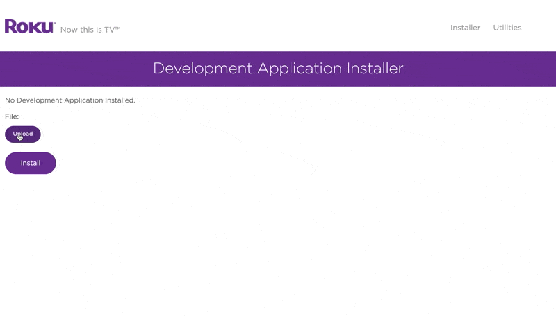

# Sideloading On Roku

This guide covers the supported way to get put.io onto a Roku device.

Roku ended private channels, so the put.io Roku app is installed by sideloading a ZIP onto a developer-enabled device.

## Before You Start

- A Roku device on the same local network as your computer
- A computer with a web browser
- A ZIP build of the app from either supported source:
  - published artifact: `https://put.io/dl/putio-roku-v2.zip`
  - generated from this repo: run `make artifact` and use `dist/apps/putio-roku-v2.zip`

Do not extract the ZIP before uploading it to Roku.

## 1. Enable Developer Mode

On your Roku remote, press this sequence:

`HOME`, `HOME`, `HOME`, `UP`, `UP`, `RIGHT`, `LEFT`, `RIGHT`, `LEFT`, `RIGHT`

The Developer Settings screen should appear.

Then:

1. Choose `Enable Developer Mode`
2. Accept the prompts
3. Set a password for the device web installer
4. Note the Roku IP address shown on screen

Your Roku will reboot after Developer Mode is enabled.

## 2. Open The Developer Installer

On a computer connected to the same network, open a browser and visit your Roku IP address.

Example:

```text
http://192.168.0.10
```

When prompted:

- username: `rokudev`
- password: the password you chose while enabling Developer Mode

## 3. Upload The App ZIP

In the Roku developer installer:

1. Choose the ZIP file
2. Select `Install`
3. Wait for the success message



This works with either the published artifact or a ZIP you generated from this repository.

After installation, the put.io channel appears on the Roku home screen as the developer app.

## Build From This Repo Instead

If you want to sideload a local branch instead of the published ZIP:

1. Copy `.env.example` to `.env`
2. Set `ROKU_DEV_TARGET` to your Roku IP address
3. Set `ROKU_DEV_PASSWORD` to the Developer Mode password if needed
4. Run `make run`

Useful commands:

- `make check-roku-dev-target` checks that the Roku developer endpoint is reachable
- `make verify` builds a fresh ZIP and runs the desktop BrightScript checker when available locally
- `make artifact` creates `dist/apps/putio-roku-v2.zip`

For the full contributor workflow, see [../CONTRIBUTING.md](../CONTRIBUTING.md)
